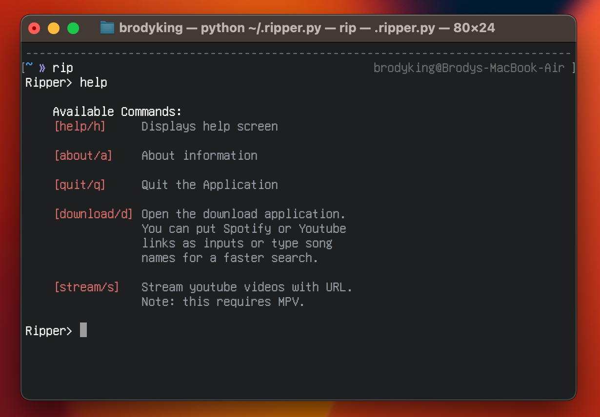

# ripper



A python application that middlemans spotdl downloads, yt-dlp downloads, and mpv youtube streaming. 

## Prerequisites
Make sure you have the following installed:
- Python
- Colorama (via pip)
- Spotdl (via pip)
- Mpv (via brew/apt)
- Ffmpeg (default installed with spotdl)
- Yt-dlp (via brew/apt)

## Installation

Download rip.py to your home folder. Usually ```~/```. After downlaoding, rename the file to ```.rip.py```. This will hide it in file explorers. 

Then, for quick access, add it to your zshrc, bashrc, etc. 
```bash
alias rip='python3 ~/.rip.py'
```

## Usage

To start, type ```rip``` into the command line. This will open the program. 

Running the ```help``` command will show the following:

```

    Available Commands:
    [help/h]     Displays help screen

    [about/a]    About information

    [quit/q]     Quit the Application

    [download/d] Open the download application.
                 You can put Spotify or Youtube
                 links as inputs or type song  
                 names for a faster search.

    [stream/s]   Stream youtube videos with URL. 
                 Note: this requires MPV.

```

## License

Do whatever you want with this. I do not care.
